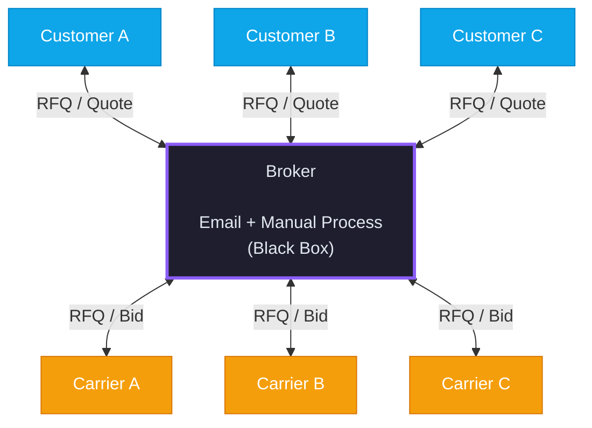

# Current State Architecture — Freight Quote Process

## Overview

The current architecture is **email-centric and human-bottlenecked**. The broker and their inbox are a single black box — the only integration point for all communication, data, and decisions. Everything funnels through one person.

---

## Hub & Spoke — Everything Through the Broker



```
                    Customer A
                        │
                   RFQ ↓↑ Quote
                        │
    Customer B ←──→ ┌────────────────────────┐ ←──→ Carrier A
                    │                        │
    RFQ / Quote     │       BROKER           │     RFQ / Bid
                    │                        │
    Customer C ←──→ │  Email + Manual Process│ ←──→ Carrier B
                    │      (Black Box)       │
                    └────────────────────────┘ ←──→ Carrier C
```

---

## What's Inside the Black Box

The broker manually handles all of the following using only email and spreadsheets:

| Input | Manual Process | Output |
|-------|---------------|--------|
| Customer RFQ email | Read, interpret, check completeness | Follow-up email or structured spreadsheet |
| Structured spreadsheet | Copy into emails for each carrier | Carrier RFQ emails |
| Carrier bid emails | Read each, extract pricing, enter into spreadsheet | Comparison spreadsheet |
| Comparison spreadsheet | Evaluate, negotiate, select, apply markup | Final quote |
| Final quote | Compose email | Quote email to customer |

---

## Key Problems

| Problem | Impact |
|---------|--------|
| **Single point of failure** | One person, one inbox. Broker unavailable = everything stops. |
| **Unstructured data** | All information lives in email threads and manually-built spreadsheets. No system of record. |
| **No audit trail** | Can't trace how a quote was built or why a carrier was selected. |
| **Serial throughput** | One quote at a time. Scaling means hiring more brokers. |
| **Error-prone** | Every data transfer is manual copy/paste. Typos, missed fields, wrong versions. |

---

## Key Insight

> The broker's inbox is not an architecture — it's the **absence** of one. Email is being used as a database, a workflow engine, a communication bus, and a filing system all at once. The broker is the only "integration layer" connecting customers, carriers, and data.
