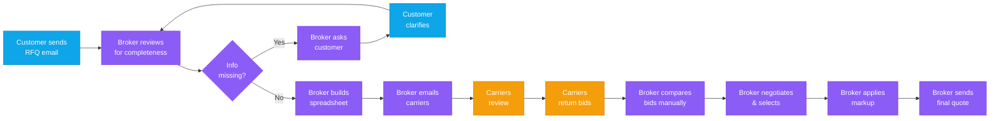
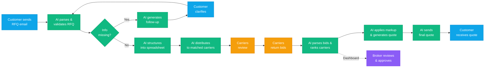
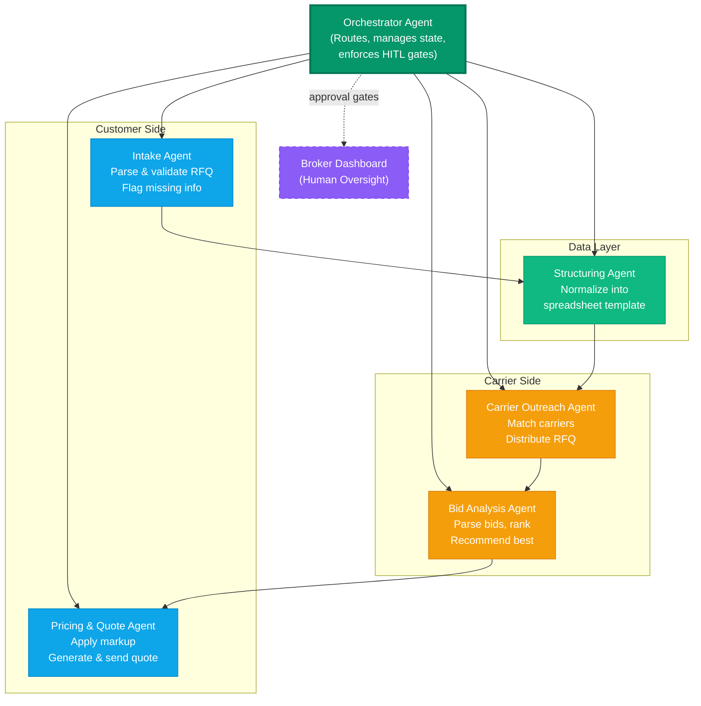

# Freight Quote Workflow — Before & After AI Automation

## Color Legend

- **Blue** — Customer (human, no change)
- **Purple** — Broker (manual work)
- **Green** — AI Agent (replaces manual broker work)
- **Amber** — Carriers (external, no change)

---

## BEFORE — Current State (Manual Broker Process)



### Current State Summary

| Step | Actor | What Happens |
|------|-------|--------------|
| 1 | Customer | Sends natural-language RFQ via email |
| 2 | Broker | Reads email, checks for completeness, follows up if missing info |
| 3 | Broker | Manually converts request into structured spreadsheet |
| 4 | Broker | Emails spreadsheet to multiple carriers one by one |
| 5 | Carriers | Review lanes and return pricing via email or spreadsheet |
| 6 | Broker | Reads all bid emails, manually compares in spreadsheet |
| 7 | Broker | Calculates markup and determines sell price |
| 8 | Broker | Emails final quote to customer |

**Pain points:** Steps 2-4 and 6-8 are manual, repetitive, and time-consuming. The broker is the bottleneck.

---

## AFTER — Future State (AI-Automated Broker Process)



### What AI Replaces

| Step | Before (Manual) | After (AI-Automated) | AI Tech |
|------|-----------------|----------------------|---------|
| 2 | Broker reads email, checks completeness | LLM parses RFQ, validates required fields, auto-generates follow-up | NLP, Email Parsing, Validation |
| 3 | Broker manually creates spreadsheet | AI extracts data into standardized template | Data Extraction, Normalization |
| 4 | Broker emails carriers one by one | AI selects carriers and sends RFQ automatically | Carrier Matching, Email Automation |
| 6 | Broker reads bid emails, compares in spreadsheet | AI ingests all bids, normalizes, ranks | Email Parsing, Scoring Model |
| 7 | Broker calculates markup manually | Pricing engine applies rules automatically | Markup Rules, Doc Generation |
| 8 | Broker emails customer | AI delivers formatted quote, logs to dashboard | Email Delivery, Audit Trail |

---

## AI Automation Detail

```
┌─────────────┐
│  CUSTOMER    │  1. Sends natural-language RFQ (email)
│  (no change) │     ↓
└──────┬───────┘
       ↓
┌──────────────────────────────────────────────────────────┐
│  AI AGENT — REPLACES MANUAL BROKER WORK                  │
│                                                          │
│  2. PARSE & VALIDATE RFQ                                 │
│     • NLP extraction: origin, destination, truck type,   │
│       insurance, lanes, truck count, pricing format      │
│     • Auto-detect missing fields                         │
│     • Generate follow-up questions to customer           │
│     Tech: LLM · Email Parsing · Validation Rules         │
│                                                          │
│  3. STRUCTURE INTO SPREADSHEET                           │
│     • Convert validated request into carrier-ready       │
│       standardized spreadsheet format                    │
│     • Zero manual data entry                             │
│     Tech: Data Extraction · Template Gen · Normalization │
│                                                          │
│  4. DISTRIBUTE TO CARRIERS                               │
│     • Auto-select relevant carriers from database        │
│       based on lane, equipment, and history              │
│     • Send structured RFQ to each carrier                │
│     Tech: Carrier Matching · Email Automation · CRM      │
│                                                          │
└──────────────────────┬───────────────────────────────────┘
                       ↓
┌─────────────┐
│  CARRIERS    │  5. Review lanes & return pricing
│  (no change) │     (email or spreadsheet)
└──────┬───────┘
       ↓
┌──────────────────────────────────────────────────────────┐
│  AI AGENT — CONTINUED                                    │
│                                                          │
│  6. PARSE BIDS & RANK CARRIERS                           │
│     • Ingest carrier responses (email or spreadsheet)    │
│     • Extract pricing, normalize into comparison matrix  │
│     • Rank by cost, service history, and operational fit │
│     Tech: Email Parsing · Bid Comparison · Scoring Model │
│                                                          │
│  7. APPLY MARKUP & GENERATE QUOTE                        │
│     • Apply configurable markup rules to selected bid    │
│     • Generate customer-ready quote in requested format  │
│     Tech: Pricing Engine · Markup Rules · Doc Generation │
│                                                          │
│  8. SEND FINAL QUOTE TO CUSTOMER                         │
│     • Deliver quote via email in professional format     │
│     • Broker reviews dashboard for oversight only        │
│     Tech: Email Delivery · Dashboard · Audit Trail       │
│                                                          │
└──────────────────────────────────────────────────────────┘
       ↓
┌─────────────┐               ┌──────────────┐
│  CUSTOMER    │  Receives     │  BROKER       │
│  (no change) │  final quote  │  (oversight   │
└─────────────┘               │   dashboard)  │
                              └──────────────┘
```

---

## Multi-Agent Hierarchy — Inside the AI Agent

The AI is not a single monolith. It's a hierarchy of specialized agents coordinated by an orchestrator.



### Agent Roles

| Agent | Domain | Responsibilities | Tech |
|-------|--------|-----------------|------|
| **Orchestrator** | Coordination | Routes work between agents, manages quote lifecycle state, enforces HITL approval gates, writes audit log | State Machine, Event Bus |
| **Intake Agent** | Customer-facing | Monitors email, parses RFQs via LLM, extracts structured fields, validates completeness, drafts follow-ups | LLM, Email API, Validation |
| **Structuring Agent** | Data | Converts validated RFQ into standardized carrier-ready spreadsheet template | Template Engine, Normalization |
| **Carrier Outreach Agent** | Carrier-facing | Selects carriers from DB by lane/equipment/history, distributes RFQ, tracks responses | Carrier DB, Matching, Email API |
| **Bid Analysis Agent** | Carrier-facing | Parses bid emails (multi-format), normalizes pricing, ranks by cost/history/fit, recommends best | LLM, Email Parsing, Scoring |
| **Pricing & Quote Agent** | Customer-facing | Applies markup rules, generates customer-ready quote, sends after broker approval | Pricing Engine, Doc Gen, Email API |
| **Broker Dashboard** | Human oversight | Real-time status, AI recommendations, approve/edit/reject gates, full audit trail | Web UI, Notifications |

### Data Flow Between Agents

```
Customer Email
    │
    ▼
┌─────────────┐    ┌──────────────┐    ┌───────────────────┐
│ Intake Agent │───▶│ Structuring  │───▶│ Carrier Outreach  │
│ (parse RFQ)  │    │ Agent        │    │ Agent             │
└─────────────┘    │ (spreadsheet)│    │ (distribute RFQ)  │
                   └──────────────┘    └─────────┬─────────┘
                                                 │
                                       Carriers respond
                                                 │
                                                 ▼
┌──────────────────┐    ┌───────────────┐    ┌─────────────┐
│ Pricing & Quote  │◀───│ Bid Analysis   │◀───│ Carrier bids│
│ Agent            │    │ Agent          │    │ (email)     │
│ (markup + send)  │    │ (parse + rank) │    └─────────────┘
└────────┬─────────┘    └───────────────┘
         │
         ▼                    ┌──────────────────┐
    Customer receives         │ Broker Dashboard  │
    final quote               │ (approve / reject │
                              │  at any gate)     │
                              └──────────────────┘
```

---

## What Changes for Each Role

### Customer
- **No change.** Still sends natural-language RFQs and receives formatted quotes.
- Faster turnaround. Follow-up questions (if any) arrive immediately.

### Broker
- **Shifts from execution to oversight.** Reviews AI decisions on a dashboard instead of doing the manual work.
- Approves/overrides carrier selection and final pricing.
- Focuses on relationship management and exception handling.

### Carriers
- **No change.** Still receive structured lane requests and return pricing.
- May get faster, more consistent communication.
