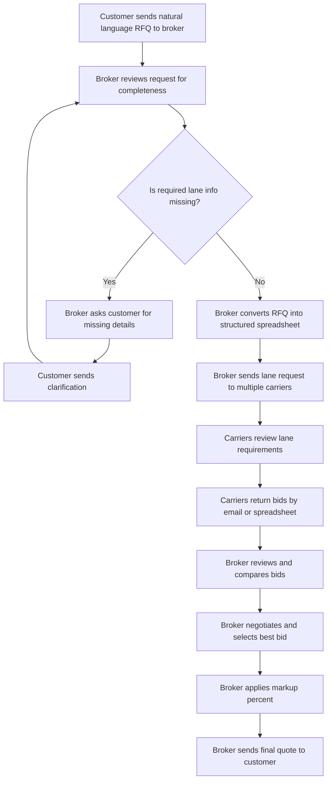
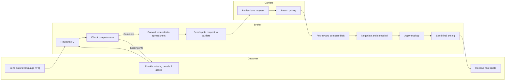

# Freight Quote Workflow Diagram

## Flowchart

```mermaid
flowchart TD
    A[Customer sends natural language RFQ to broker] --> B[Broker reviews request for completeness]
    B --> C{Is required lane info missing?}
    C -->|Yes| D[Broker asks customer for missing details]
    D --> E[Customer sends clarification]
    E --> B
    C -->|No| F[Broker converts RFQ into structured spreadsheet]
    F --> G[Broker sends lane request to multiple carriers]
    G --> H[Carriers review lane requirements]
    H --> I[Carriers return bids by email or spreadsheet]
    I --> J[Broker reviews and compares bids]
    J --> K[Broker negotiates and selects best bid]
    K --> L[Broker applies markup percent]
    L --> M[Broker sends final quote to customer]
```

## Swimlane View

```mermaid
flowchart LR
    subgraph Customer
        C1[Send natural language RFQ]
        C2[Provide missing details if asked]
        C3[Receive final quote]
    end

    subgraph Broker
        B1[Review RFQ]
        B2[Check completeness]
        B3[Convert request into spreadsheet]
        B4[Send quote request to carriers]
        B5[Review and compare bids]
        B6[Negotiate and select bid]
        B7[Apply markup]
        B8[Send final pricing]
    end

    subgraph Carriers
        R1[Review lane request]
        R2[Return pricing]
    end

    C1 --> B1
    B1 --> B2
    B2 -->|Missing info| C2
    C2 --> B1
    B2 -->|Complete| B3
    B3 --> B4
    B4 --> R1
    R1 --> R2
    R2 --> B5
    B5 --> B6
    B6 --> B7
    B7 --> B8
    B8 --> C3
```
